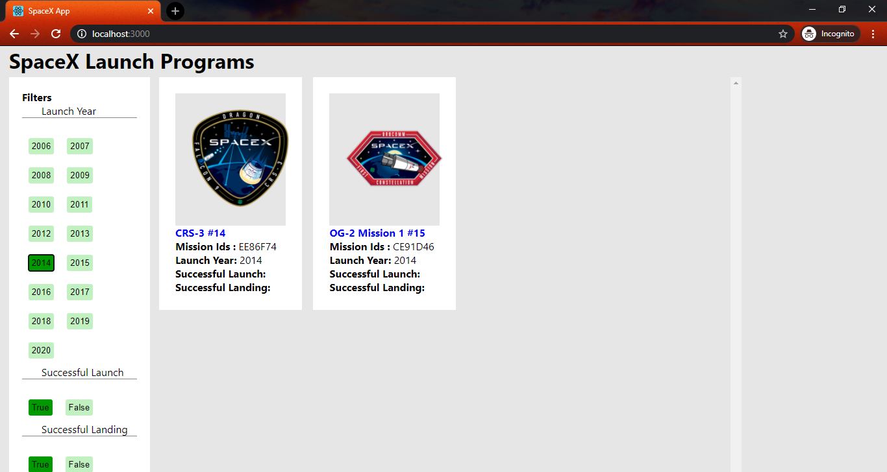
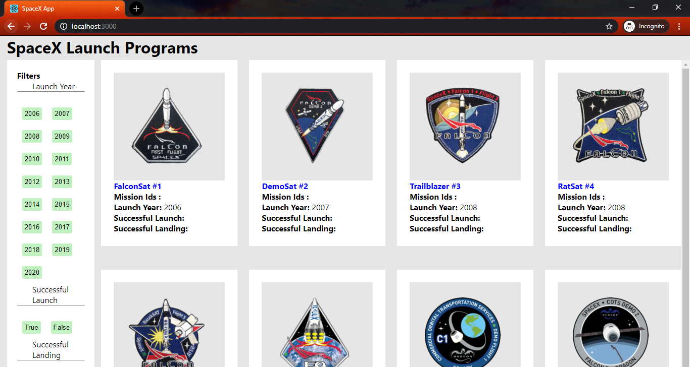
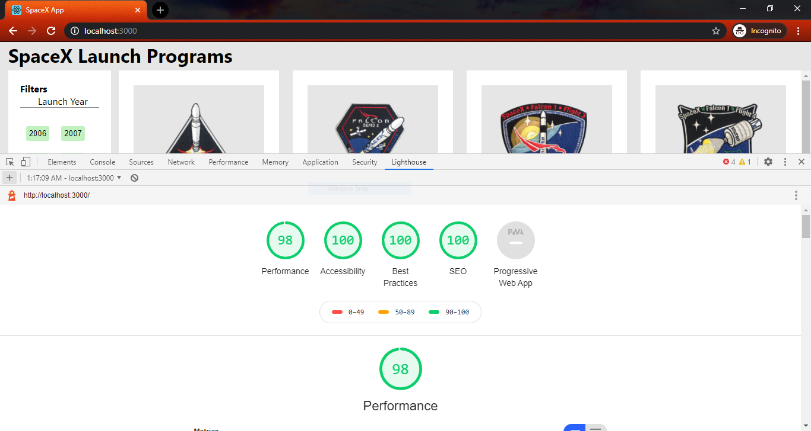
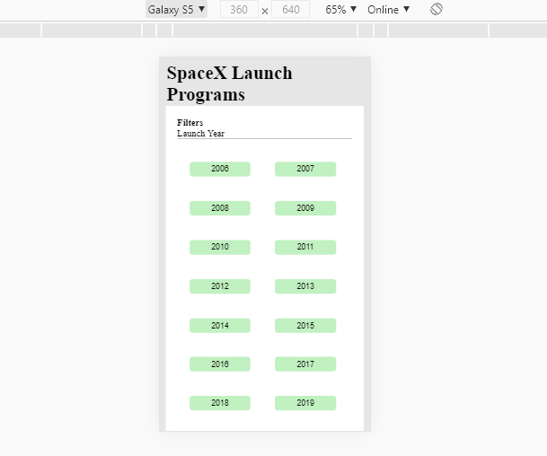
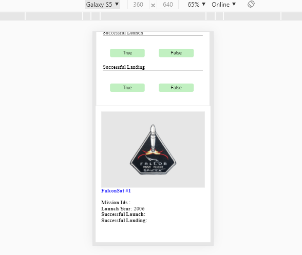
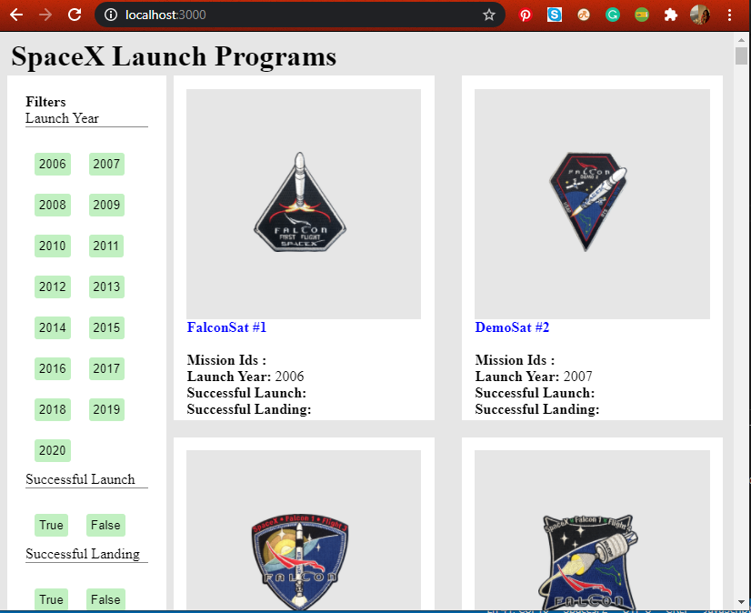
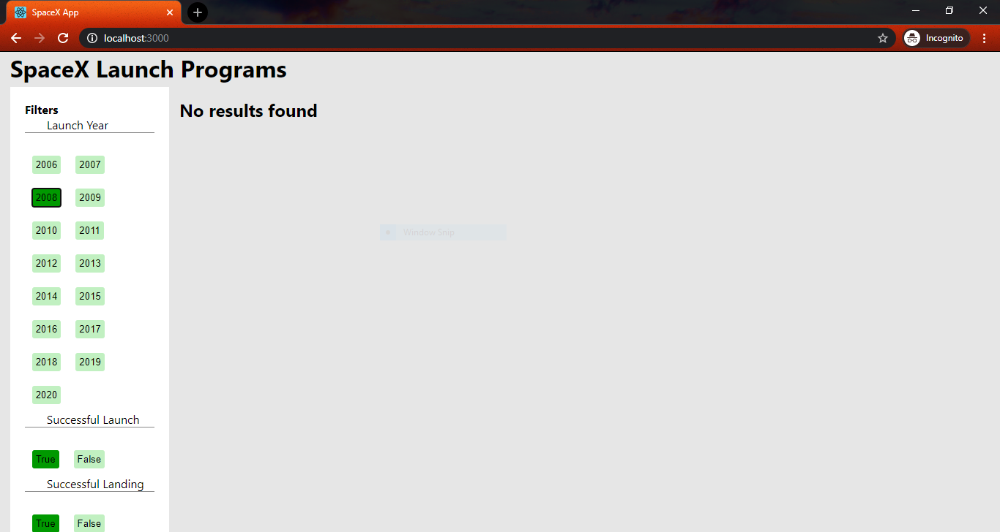

# SpaceX-Responsive
Displaying SpaceX launch data by option to filter by year, launch success, landing success

1. Displays SpaceX launch data with filter options: year, launch success and landing success.
2. Used Redux for state management.
3. Server side rendering implemented using Express server.
4. Responsive app designed using media queries for mobile, tablet and desktop.

<b>Filtered Data<b/>

  
<b>Initial load<b/>

  
<b>Lighthouse score<b/>
 
  
 <b>Mobile image<b/>

  
 <b>Filtered mobile image<b/>

  
 <b>Tablet view<b/>

  
 <b>No results<b/>

